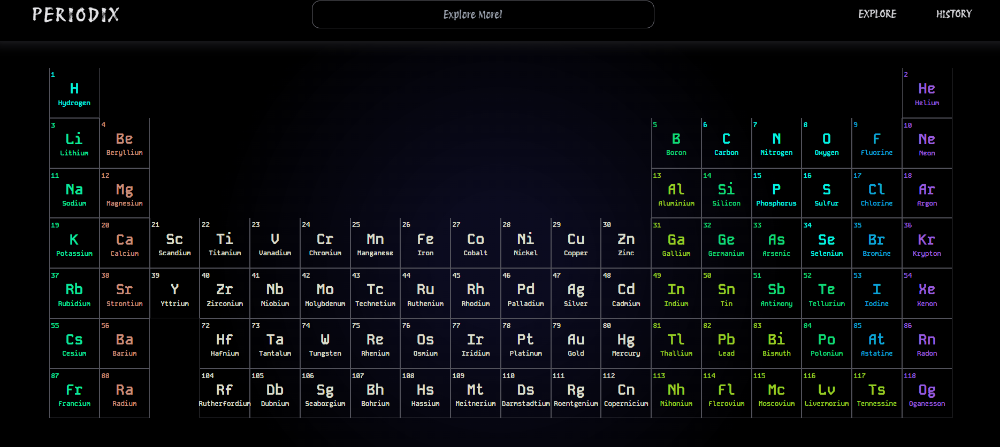
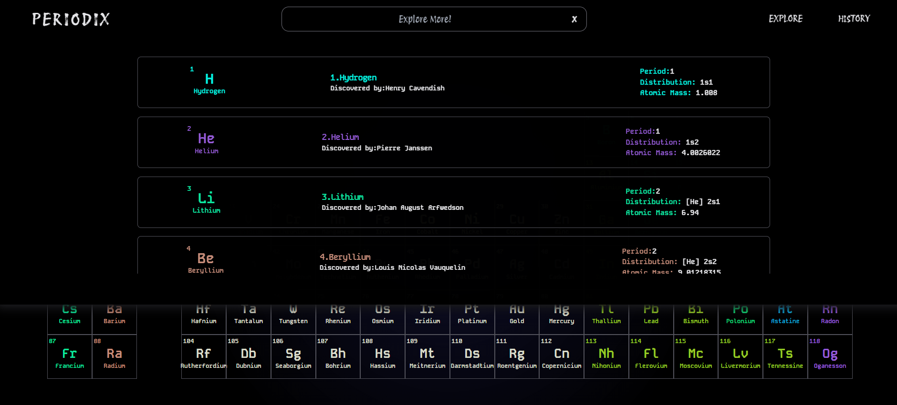

This is a [Next.js](https://nextjs.org/) project bootstrapped with [`create-next-app`](https://github.com/vercel/next.js/tree/canary/packages/create-next-app).

## Getting Started

First, run the development server:

```bash
npm run dev
# or
yarn dev
# or
pnpm dev
# or
bun dev
```

Open [http://localhost:3000](http://localhost:3000) with your browser to see the result.

You can start editing the page by modifying `app/page.js`. The page auto-updates as you edit the file.

This project uses [`next/font`](https://nextjs.org/docs/basic-features/font-optimization) to automatically optimize and load Inter, a custom Google Font.

## Learn More

To learn more about Next.js, take a look at the following resources:

- [Next.js Documentation](https://nextjs.org/docs) - learn about Next.js features and API.
- [Learn Next.js](https://nextjs.org/learn) - an interactive Next.js tutorial.

You can check out [the Next.js GitHub repository](https://github.com/vercel/next.js/) - your feedback and contributions are welcome!

## Deploy on Vercel

The easiest way to deploy your Next.js app is to use the [Vercel Platform](https://vercel.com/new?utm_medium=default-template&filter=next.js&utm_source=create-next-app&utm_campaign=create-next-app-readme) from the creators of Next.js.

Check out our [Next.js deployment documentation](https://nextjs.org/docs/deployment) for more details.

# Periodix 🧪  
### A Modern Next.js Web Application

🚀 **Live Demo:** https://periodix-chi.vercel.app/  
📂 **GitHub Repository:** https://github.com/Geeta-0410/periodix-main

---

## 📌 Overview

**Periodix** is a modern, responsive web application built using **React.js**.  
The project focuses on clean UI, optimized performance, and scalable architecture, following best practices of modern frontend development.

It demonstrates strong fundamentals in **React.js routing, component-based design, and deployment on Vercel**.

---

## ✨ Features

- ⚡ Built with **Next.js** for high performance and SEO
- 🎨 Clean and responsive UI
- 🧩 Component-based architecture
- 🔤 Optimized fonts using `next/font`
- ☁️ Deployed on **Vercel**
- 📱 Fully responsive across devices

---

## 🛠️ Tech Stack

- **Frontend:** React.js  
- **Styling:** CSS / Tailwind (if applicable)  
- **Deployment:** Vercel  
- **Package Manager:** npm / yarn / pnpm  
- **Version Control:** Git & GitHub  

---

## 🌐 Live Deployment

The application is live and accessible here:  
👉 **https://periodix-chi.vercel.app/**

---

## 🚀 Getting Started (Local Setup)

Clone the repository:

```bash
git clone https://github.com/Geeta-0410/periodix-main.git
cd periodix-main

Install dependencies:

npm install

Install dependencies:

npm install

periodix-main/
├── app/
│   ├── page.js
│   └── layout.js
├── public/
├── styles/
├── package.json
└── README.md

---

## 🖼️ Screenshots

### 🔹 Interactive Periodic Table


### 🔹 Element History & List View


### 🔹 Element Detailed Information


---
